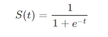
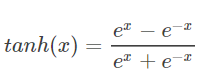
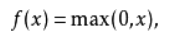

# 神经网络

## 组成

典型的人工神经网络具有以下三个部分：

**结构**（Architecture）结构指定了网络中的变量和它们的拓扑关系。例如，神经网络中的变量可以是神经元连接的权重（weights）和神经元的激励值（activities of the neurons）。  
**激励函数**（Activation Rule）大部分神经网络模型具有一个短时间尺度的动力学规则，来定义神经元如何根据其他神经元的活动来改变自己的激励值。一般激励函数依赖于网络中的权重（即该网络的参数）。  
**学习规则**（Learning Rule）学习规则指定了网络中的权重如何随着时间推进而调整。这一般被看做是一种长时间尺度的动力学规则。一般情况下，学习规则依赖于神经元的激励值。它也可能依赖于监督者提供的目标值和当前权重的值。例如，用于手写识别的一个神经网络，有一组输入神经元。输入神经元会被输入图像的数据所激发。在激励值被加权并通过一个函数（由网络的设计者确定）后，这些神经元的激励值被传递到其他神经元。这个过程不断重复，直到输出神经元被激发。最后，输出神经元的激励值决定了识别出来的是哪个字母。  
                        --------[Wikipedia](https://zh.wikipedia.org/wiki/%E4%BA%BA%E5%B7%A5%E7%A5%9E%E7%BB%8F%E7%BD%91%E7%BB%9C#%E5%88%86%E7%B1%BB)

## 激活函数(Activation Rule)

激活函数的一般性质:
可微，非线性，计算简单，单调，输出值有一定范围，归一化。

归一化：把数据映射到(0,1)范围内处理。

主要有三种：  
Sigmoid 函数,Tanh 函数(双曲正切),Relu函数

### Sigmoid 函数

表达式为

它长这样  

一些性质：类似于生物学上的S型函数，关于(0,0.5)中心对称，两边过于平坦，处处可微。值域(0,1)。在边界处于饱和状态。

缺点：会有梯度弥散。不根据原点对称。计算耗时大。

梯度弥散：使用反向传播算法传播梯度的时候,随着传播深度的增加,梯度的幅度会急剧减小,会导致浅层神经元的权重更新非常缓慢,不能有效学习。
### Tanh 函数

一些性质：关于(0,0)中心对称，两边平滑。

优点：相对于前者，关于原点对称，计算较快。
缺点：仍未改变梯度弥散问题。
### Relu 函数



单侧抑制，有一个阈值，超过了这个阈值就激活，小于阈值就是0。小于阈值的话不可导。计算更快，稀疏激活性更大（导数再正值区为常数，负值区为0。）

优缺点：解决了部分梯度弥散问题，收敛速度更快。但仍未完全解决梯度弥散问题，然后在负区神经元die且不可复活。
由于反向传播等问题，升级了Relu函数。

### leaky Relu 函数

解决了神经元die的问题。

(未完待续)